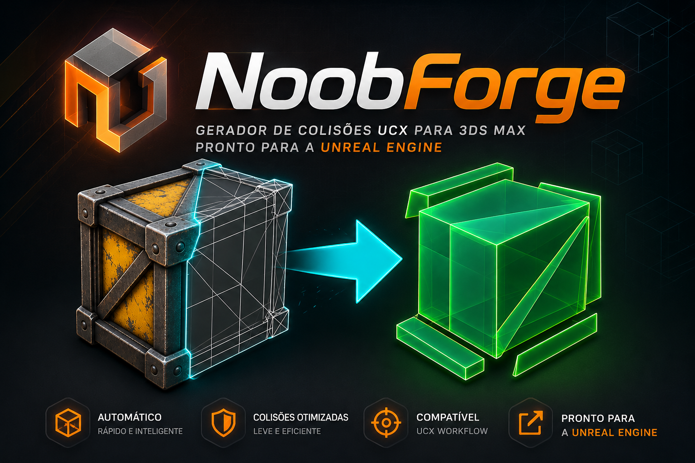
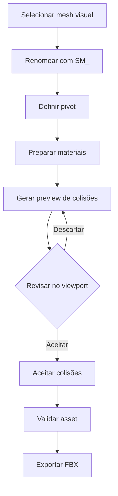
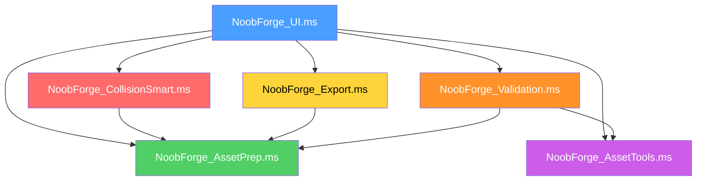

<p align="center">
  
</p>

<h1 align="center">NoobForge</h1>

<p align="center">
  <strong>Preparação de assets do 3ds Max para Unreal Engine</strong><br>
  Colisões inteligentes · Materiais limpos · Exportação FBX segura
</p>

<p align="center">
  
  
  
  
  
</p>

---

## 📋 Sumário

- [Sobre](#-sobre)
- [Recursos](#-recursos)
- [Instalação](#-instalação)
- [Primeiros Passos](#-primeiros-passos)
- [Fluxo de Trabalho](#-fluxo-de-trabalho)
- [Colisões Inteligentes](#-colisões-inteligentes)
- [Materiais](#-materiais)
- [Pivot](#-pivot)
- [Validação](#-validação)
- [Exportação FBX](#-exportação-fbx)
- [Arquitetura](#-arquitetura)
- [Testes](#-testes)
- [Limitações Conhecidas](#-limitações-conhecidas)
- [Roadmap](#-roadmap)
- [Changelog](#-changelog)
- [Contribuindo](#-contribuindo)
- [Créditos](#-créditos)

---

## 🎯 Sobre

O **NoobForge** é uma ferramenta MAXScript completa que automatiza a preparação de assets estáticos (Static Meshes) no Autodesk 3ds Max para importação na Unreal Engine. Ele cuida de nomenclatura, pivot, limpeza de materiais, geração inteligente de colisões, validação pré-exportação e exportação FBX — tudo em uma única interface em português do Brasil.

> **A malha visual original nunca é modificada.** Todas as operações trabalham em cópias ou nodes dedicados.

---

## ✨ Recursos

### 🔧 Asset e Pivot
- Renomeia assets com prefixo `SM_` e sincroniza nomes de colisões e sockets
- Posiciona pivot na **base**, no **centro** ou no **piso mundial (Z=0)**

### 🎨 Materiais
- Converte Corona, V-Ray, Physical e outros materiais para **Standard limpo**
- Preserva UVs, Material IDs, nomes de slots e estruturas Multi/Sub-Object
- Opção de manter a cor base original ou usar cinza neutro

### 💥 Colisões Inteligentes
- Gera colisões `UBX_` (Box), `USP_` (Sphere) e `UCP_` (Capsule) reconhecidas pela Unreal
- **Modo Auto** analisa cada pedaço e escolhe a primitiva mais adequada
- **PCA/OBB** orienta caixas e cápsulas conforme a geometria real — uma viga inclinada a 40° recebe uma única UBX girada
- **Divisão adaptativa** com eixos PCA + eixos locais para formas ortogonais (ex: balcão em "L")
- **4 presets** prontos: Mobiliário, Arquitetura, Orgânico, Physics Prop
- **Preview laranja** para revisão visual antes de aceitar
- Aceita substituindo colisões anteriores ou descarta o preview

### ✅ Validação
- Verifica nome, escala, UV Channel 1, materiais e colisões antes do envio

### 📦 Exportação FBX
- Exportação em lote da seleção ou de todos os assets `SM_` da cena
- Um FBX por asset, incluindo colisões e sockets automaticamente
- Validação opcional antes do lote, com bloqueio de assets inválidos
- Pastas individuais opcionais e relatório CSV detalhado
- Exportação em cópias temporárias — a cena nunca é alterada
- Validação pós-gravação com restauração automática em caso de falha

---

## 📥 Instalação

### Instalação Rápida (Recomendada)

1. Baixe o arquivo `NoobForge_Installer_1.0.4.mzp` da [página de releases](../../releases)
2. Arraste o `.mzp` para qualquer viewport do 3ds Max
3. Confirme a **instalação limpa** para remover versões anteriores
4. O NoobForge será aberto automaticamente — não é necessário reiniciar

### Botão Permanente na Toolbar

1. Menu **Customize** → **Customize User Interface**
2. Na aba **Toolbars**, selecione a categoria **NoobViz**
3. Arraste a ação **NoobForge_Open** para uma toolbar

O ícone é instalado automaticamente em `#userIcons\Dark\NoobForge` e `#userIcons\Light\NoobForge` para os temas Dark e Light.

### Instalação Manual (Desenvolvimento)

```
1. Clone este repositório
2. No 3ds Max: Scripting > Run Script > NoobForge.ms
```

---

## 🚀 Primeiros Passos

1. Selecione uma mesh visual na cena
2. Abra o NoobForge (toolbar ou `Scripting > Run Script`)
3. Renomeie o asset com `SM_` e posicione o pivot
4. Gere o preview de colisões e revise no viewport
5. Aceite as colisões, valide e exporte o FBX

---

## 🔄 Fluxo de Trabalho



### Passo a passo detalhado

| Etapa | Ação | Resultado |
|-------|------|-----------|
| 1 | Otimize a malha (ProOptimizer) | Mesh com polycount adequado |
| 2 | Renomeie e defina o pivot | `SM_NomeDoAsset` com pivot posicionado |
| 3 | Prepare os materiais | Cópia `_UE` com materials Standard na layer `NoobForge_Export` |
| 4 | Escolha preset e gere preview | Primitivas laranjas na layer `NoobForge_CollisionPreview` |
| 5 | Revise as primitivas no viewport | Confirme cobertura e quantidade |
| 6 | Aceite ou descarte | Primitivas finais na layer `NoobForge_Collision` |
| 7 | Valide | Relatório de erros e avisos |
| 8 | Exporte | Um FBX por mesh visual |

---

## 💥 Colisões Inteligentes

### Presets de Colisão

| Preset | Limite padrão | Uso recomendado |
|--------|:------------:|-----------------|
| **Mobiliário** | 24 | Sofás, mesas, cadeiras, armários |
| **Arquitetura** | 24 | Paredes, pilares, bancadas, escadas |
| **Orgânico** | 24 | Pedras, troncos, vegetação |
| **Physics Prop** | 24 | Objetos que simulam física |
| **Personalizado** | 1–64 | Ajuste manual do spinner |

### Modo Auto Inteligente

Cada pedaço é analisado individualmente por PCA (Principal Component Analysis):

| Critério | Resultado |
|----------|-----------|
| Superfícies ortogonais (> 96.5%) | `Box (UBX)` |
| Região esférica (roundness > 0.78, variação radial < 0.16) | `Sphere (USP)` |
| Região alongada com seção circular | `Capsule (UCP)` |
| Forma ambígua | `Box (UBX)` como fallback |

### Orientação por PCA/OBB

As caixas e cápsulas são orientadas conforme a **forma real da geometria**, não apenas pelo bounding box axis-aligned:

- Uma **viga inclinada a 40°** recebe uma única UBX girada a ~40°
- Um **sofá** gera múltiplas caixas para braços, assento e encosto
- Uma **forma em "L"** é decomposta com eixos ortogonais (world axes) apesar do PCA ser diagonal
- Peças **simétricas** mantêm eixos world para evitar rotações instáveis entre execuções

### Divisão Adaptativa

O limite de volumes é um **teto**, não uma quantidade obrigatória. A decomposição para automaticamente quando:

- Novas divisões não melhoram o envelope (ganho local < 2%)
- O ganho global fica abaixo de 0.75%
- A ocupação já atinge 82% (mesh vs. colisão)
- O retorno diminuiu drasticamente (platô de ganho)

### Preview e Aceitação

```
SM_Sofa_UE                    ← mesh visual (não é modificada)
├── NF_PREVIEW_001            ← preview laranja (não exporta)
├── NF_PREVIEW_002
└── NF_PREVIEW_003

↓ Após aceitar:

SM_Sofa_UE
├── UBX_SM_Sofa_UE_00         ← colisão final (layer NoobForge_Collision)
├── UBX_SM_Sofa_UE_01
└── USP_SM_Sofa_UE_00
```

### Nomenclatura Unreal

```
UBX_NomeDoAsset_00    → Box collision
USP_NomeDoAsset_00    → Sphere collision
UCP_NomeDoAsset_00    → Capsule collision
UCX_NomeDoAsset_00    → Convex hull (manual)
SOCKET_NomeDoAsset_00 → Socket
```

O NoobForge reconhece e exporta colisões `UCX_` criadas manualmente. Referência: [Epic Games — FBX Static Mesh Pipeline](https://dev.epicgames.com/documentation/unreal-engine/fbx-static-mesh-pipeline-in-unreal-engine?lang=en-US).

---

## 🎨 Materiais

Cada objeto selecionado recebe uma **cópia** na layer `NoobForge_Export`. Somente o material da cópia é substituído.

| Opção | Comportamento |
|-------|---------------|
| **Manter cor base** ✅ | Procura `baseColor`, `diffuse`, `color` e cria Standard com essa cor |
| **Manter cor base** ❌ | Slots recebem cinza neutro `(128, 128, 128)` |

**Preservados:** UVs, geometria, Material IDs, transforms, nomes de slots, estruturas Multi/Sub-Object.

**Compatível com:** Corona, V-Ray, Physical Material, Standard, e qualquer material com propriedade de cor difusa.

---

## 📐 Pivot

| Modo | Descrição |
|------|-----------|
| **PIVOT BASE** | Centro inferior do bounding box mundial |
| **CENTRO** | Centro do volume do asset |
| **PIVOT Z=0** | X/Y centralizados, pivot no piso mundial (sem mover geometria) |

Na exportação com "Pivot como origem", somente cópias temporárias são deslocadas. Uma bancada suspensa preserva a altura correta no FBX e o objeto da cena permanece no lugar.

---

## ✅ Validação

A validação pré-exportação verifica:

| Verificação | Severidade | Descrição |
|-------------|:----------:|-----------|
| Prefixo `SM_` | ⚠️ Aviso | Nome deve começar com `SM_` |
| Caracteres inválidos | ❌ Erro | Espaços, pontos e caracteres especiais |
| Escala zero | ❌ Erro | Componente de escala ≤ 0.001 |
| Escala não-uniforme | ❌ Erro | Box e Sphere falham na Unreal |
| Escala ≠ 100% | ⚠️ Aviso | Transform de escala não resetado |
| Escala negativa | ⚠️ Aviso | Espelhamento — revise Reset XForm |
| Material ausente | ⚠️ Aviso | Nenhum material atribuído |
| UV Channel 1 | ❌ Erro | UV ausente ou vazio |
| Colisões | ⚠️ / ❌ | Nenhuma (aviso) ou mais de 64 (erro) |

---

## 📦 Exportação FBX

### Preset FBX

| Configuração | Valor |
|--------------|-------|
| Formato | FBX Binário 2020 |
| Unidade | Centímetros |
| Triangulação | Ativada |
| Smoothing Groups | Ativados |
| Tangent Space | Ativado |
| Animações | Desativadas |
| Câmeras / Luzes | Desativadas |
| Texturas incorporadas | Desativadas |

### Processo Seguro

Para cada asset, o exportador:

1. **Coleta** a mesh, suas colisões (`UBX_`, `USP_`, `UCP_`, `UCX_`) e sockets
2. **Cria cópias** temporárias isoladas
3. **Aplica** a origem de pivot apenas nas cópias
4. **Grava** um FBX temporário
5. **Valida** que o arquivo existe e não está vazio
6. **Substitui** o destino somente após validação
7. **Remove** todos os nodes temporários e restaura a seleção

> Se a gravação falhar, o FBX anterior é restaurado automaticamente.

### Exportação em lote

O lote pode trabalhar apenas com os assets selecionados ou localizar automaticamente todas as meshes `SM_` da cena. Antes de cada exportação, o NoobForge pode validar nome, escala, UV e colisões, ignorar assets com erros, criar uma pasta por asset e gerar um relatório CSV com status, avisos, duração e caminho de cada FBX.

---

## 🏗️ Arquitetura

```
NoobForge.ms                    ← Entry point e carregamento de módulos
NoobForge.mcr                   ← MacroScript para toolbar/ribbon
NoobForge_Install.ms             ← Instalador (.mzp)
Banner.png                       ← Banner da interface
Icone.png                        ← Ícone para toolbar Dark/Light
modules/
  ├── NoobForge_AssetPrep.ms     ← Materiais, layers, decomposição espacial, primitivas AABB
  ├── NoobForge_CollisionSmart.ms ← PCA/OBB, classificação Auto, preview, divisão orientada
  ├── NoobForge_Export.ms         ← Lote, associação de nodes, relatório e transação FBX segura
  ├── NoobForge_AssetTools.ms     ← Rename, pivot, sockets
  ├── NoobForge_Validation.ms     ← Diagnóstico pré-exportação
  ├── NoobForge_Updater.ms        ← Consulta, download e validação de updates
  └── NoobForge_UI.ms             ← Interface, banner, eventos, presets
tests/
  ├── CollisionTest.ms            ← Decomposição de sofá, batch path, viewport
  ├── CollisionQualityTest.ms     ← Cubo perfeito, L-shape, mesh aberta, escala
  ├── SmartCollisionTest.ms       ← Auto-classificação, PCA 40°, L-shape, preview
  ├── PrimitiveCollisionTest.ms   ← Esfera, cápsula, orientação por eixo
  ├── ExportTest.ms               ← Exportação FBX e reimportação
  ├── BatchExportTest.ms          ← Lote por cena, validação, pastas e CSV
  ├── MaterialTest.ms             ← Conversão de materiais
  └── UITest.ms                   ← Interface e eventos
```

### Diagrama de Dependências



---

## 🧪 Testes

Os testes automatizados são executados via `3dsmaxbatch.exe` e cobrem:

| Teste | Cobertura |
|-------|-----------|
| `CollisionTest.ms` | Decomposição de sofá, limites, batch path, viewport display |
| `CollisionQualityTest.ms` | Cubo perfeito (1 peça), L-shape (decomposta), duplicatas, mesh aberta, escala não-uniforme, mesh degenerada |
| `SmartCollisionTest.ms` | Auto Box/Sphere/Capsule, PCA 40° (1 UBX alinhada), L-shape (regressão PCA), preview/aceite |
| `PrimitiveCollisionTest.ms` | Esfera (raio correto), cápsula (orientação, seção circular), eixos X/Y/Z |
| `ExportTest.ms` | FBX completo, reimportação, validação de origem |
| `BatchExportTest.ms` | Lote por cena, filtro `SM_`, validação, pastas, CSV e restauração da seleção |
| `MaterialTest.ms` | Conversão Corona/V-Ray/Physical, Multi/Sub, cor base |
| `UITest.ms` | Interface e eventos |

### Executando os testes

```bat
"C:\Program Files\Autodesk\3ds Max 2026\3dsmaxbatch.exe" -sceneFile "" tests\SmartCollisionTest.ms
```

---

## ⚠️ Limitações Conhecidas

- As colisões são **aproximações simples** — revise áreas críticas de interação
- `USP_` é limitado na Unreal para certos tipos de trace
- `UBX_` e `USP_` não devem receber escala não-uniforme na Unreal
- O modo Auto é **determinístico**, mas não substitui decisões artísticas em assets muito irregulares
- Convex hull `UCX_` automático **não faz parte desta versão**
- Requer 3ds Max 2022 ou superior (testado até 2026)

---

## 🗺️ Roadmap

- [ ] Geração automática de convex hull `UCX_`
- [ ] Suporte a LODs automáticos
- [x] Exportação batch de múltiplos assets
- [ ] Preset de colisão por categoria de asset
- [ ] Integração com Unreal Engine via Python bridge

---

## 📝 Changelog

### v1.0.4 — 2026-09-03

#### 🎉 Novidades
- **Nova Interface (Tabs):** A UI foi reescrita e dividida em 4 abas (Asset, Materiais, Colisões, Exportação), reduzindo drasticamente a altura da janela e organizando melhor as ferramentas.

### v1.0.3 — 2026-09-03

#### 🎉 Novidades
- Adicionado botão manual "Atualizar" na interface principal
- Verificações manuais de atualização informam se o plugin já está na última versão

### v1.0.2 — 2026-09-03

#### 🎉 Novidades
- Exportação FBX em lote pela seleção ou por todos os assets `SM_` da cena
- Validação prévia com opção de ignorar assets inválidos
- Pastas individuais por asset e relatório CSV com resultado e duração

#### ✅ Testes
- Adicionado `BatchExportTest.ms` para validar o fluxo completo do lote

### v1.0.1 — 2026-09-03

#### 🔧 Correções
- **Corrigida regressão em formas ortogonais (L-shape)** — A divisão orientada por PCA agora combina volume OBB e AABB (`min(OBB, AABB)`) para avaliar filhas. Peças ortogonais usam AABB automaticamente, enquanto peças inclinadas continuam se beneficiando do OBB
- **Deduplicação de eixos de corte** — Eixos PCA quase-paralelos aos eixos world são filtrados (dot > 0.98), evitando cortes redundantes e empate de pontuação
- **Volume consistente no loop de subdivisão** — O `currentVolume` agora usa a mesma métrica das filhas

#### ✅ Testes
- Adicionado teste de regressão para forma em "L" no `SmartCollisionTest.ms`

---

### v1.0.0 — 2026

#### 🎉 Release Inicial
- Interface completa em português do Brasil
- Rename com `SM_` e sincronização de colisões/sockets
- Pivot: base, centro e Z=0
- Conversão de materiais (Corona, V-Ray, Physical → Standard)
- Colisões inteligentes com PCA/OBB
- Modo Auto (UBX, USP, UCP)
- 4 presets de colisão
- Preview laranja com aceite/descarte
- Validação pré-exportação
- Exportação FBX segura com transação
- Ícones para toolbar Dark/Light
- Suite de testes automatizados

---

<!-- Template para futuras versões:

### vX.Y.Z — YYYY-MM-DD

#### 🎉 Novidades
- Descrição da feature

#### 🔧 Correções
- Descrição do bugfix

#### ⚡ Melhorias
- Descrição da melhoria de performance/UX

#### ⚠️ Breaking Changes
- Descrição da mudança incompatível

#### ✅ Testes
- Novos testes adicionados

-->

---


## 👤 Créditos

Desenvolvido por **NoobDev** — [@FernandoSilvaC](https://github.com/FernandoSilvaC)

---

<p align="center">
  <sub>Feito com ☕ para a comunidade 3ds Max + Unreal Engine</sub>
</p>
